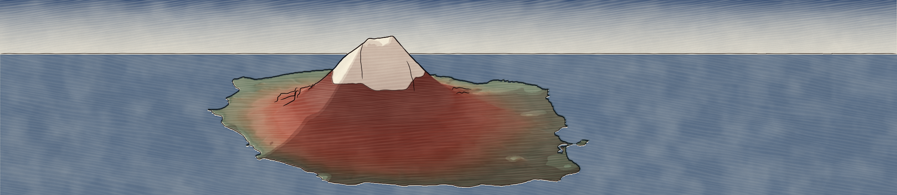
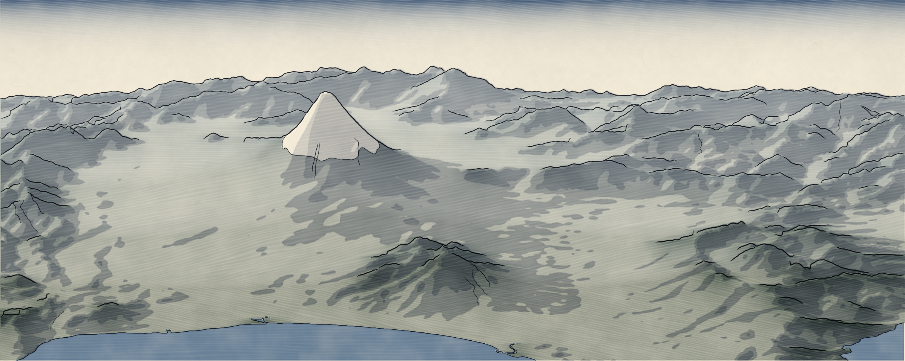
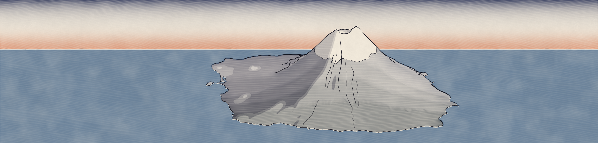

# Ukiyo-e Relief

A QGIS plugin that renders a digital elevation model as a Japanese woodblock print (ukiyo-e).



Everything is computed from the DEM by a deterministic algorithm. There is no AI and no hand painting, and the same parameters with the same seed always give the same print. The plugin needs only what ships with QGIS: Python, numpy, GDAL and matplotlib. If SciPy is present it is used for faster connected-component labelling, but it is optional.

## What it does

There are two output modes:

- **Plan view**: a map seen from above, saved as an RGB GeoTIFF in the CRS of the source DEM (optionally also as a PNG). Elevation is posterised into flat colour plates, outlined by a key block, with shadow plates, ridge strokes and water.
- **Layered landscape**: an oblique view saved as a PNG without georeferencing. The terrain is drawn either as receding ridges whose colour fades with distance (after Hiroshige) or as elevation zones (after Hokusai's *Red Fuji*). Outlines are drawn only on true silhouettes, the snow line follows gullies, and the sky band is graded with bokashi.

Both modes finish with a simulated print run. Each colour plate is inked and printed separately onto washi paper, with slight misregistration, wood grain, baren mottling and ink pooling at plate edges. Areas left as bare paper get blind embossing (karazuri).

## Installation

1. Download `ukiyoe_relief-<version>.zip` from the [Releases](../../releases) page (not the green *Code → Download ZIP* button: that archive has a different folder layout).
2. In QGIS, open *Plugins → Manage and Install Plugins → Install from ZIP* and select it.
3. The tool appears under *Raster → Ukiyo-e Relief* and on its own toolbar.

QGIS 3.22 or newer is required.

## Usage

1. Choose a DEM layer and an output file.
2. Optionally, tick *Limit to current map canvas extent* to render only what is visible on the map.
3. Pick a mode and a palette, then press **Print**.

Rendering runs as a background task. A plan view result can be added straight to the project.

Fields that have no effect with the current settings are greyed out.

The rendering core can also be called from the QGIS Python console without the dialog:

```python
from ukiyoe_relief.core import params, pipeline

p = params.defaults()
p.mode = "Layered landscape"
p.preset = "Hokusai - Red Fuji"
pipeline.run_file(r"E:/dem.tif", r"E:/dem_ukiyoe.png", p)
```



## Parameters

### General

| Parameter | Meaning |
|---|---|
| Mode | *Plan view* (GeoTIFF) or *Layered landscape* (PNG). |
| Palette | Pigment set: Hokusai Prussian blue, Hokusai Red Fuji, Hiroshige Dusk, Sumi monochrome, Shin-hanga Snow. |
| Working size | Longest side of the working raster, in pixels. In landscape mode this is the exact sheet width. |
| Random seed | Fixes every random element: grain, misregistration, line wobble. |
| Sun azimuth / altitude | Light direction for shading. |
| Vertical exaggeration for shading | z-factor of the hillshade. |
| Block generalisation | Gaussian smoothing of the DEM before plates and shadows are built, i.e. how coarsely the blocks are cut. |

### Plates

| Parameter | Meaning |
|---|---|
| Colour zones | Number of flat colour plates. |
| Light influence on zones | Plan view only. 0 means zones follow elevation; 1 means they follow illumination. |
| Bare-paper snow / Snow-capped area fraction | The highest part of the relief is left unprinted. The fraction is a share of the land area, so a lower value raises the snow line. |
| Plate smoothing | Smooths zone boundaries before posterisation. |
| Minimum island area | Smaller patches are merged into their neighbours. |
| Bokashi | Strength of the ink gradient inside each plate. |
| Shadow levels / area / density | Overprinted shadow plates taken from the hillshade. |
| Water | *Sea (auto)*: cells at or below the water level that connect to the sheet edge. *All cells at or below level*: every such cell, including inland lakes. *Off*: no water. |
| Water level / tolerance | Sea level in DEM units, plus a tolerance for noisy sea surfaces. |
| Treat NoData as sea | For coastal DEMs where the sea is stored as NoData. |
| Shore echo lines | Lines along the coast drawn in the water (plan view). |

### Lines

| Parameter | Meaning |
|---|---|
| Key-block outlines | Turns the black line block on or off. |
| Outline width / Hand wobble | Stroke width and a small noise displacement imitating a hand-cut line. |
| Minimum line length | Shorter strokes are dropped. |
| Outline shadow plates too | Also outlines the shadow areas (plan view). |
| Ridge strokes | Short tapered strokes running downslope from ridge crests (plan view), with spacing, amount, length and width. |

### Printing

| Parameter | Meaning |
|---|---|
| Misregistration (kento) | Random offset of each colour plate relative to the key block. |
| Wood grain / period | Plank texture in the inked areas. |
| Baren mottling | Uneven pressure of the hand burnisher (baren). |
| Ink pooling at plate edges | Darker ink along the edges of each plate. |
| Washi texture / Paper fibres | Paper tone variation and embedded fibres. |
| Blind embossing (karazuri) | Relief pressed into the bare paper. |

### Landscape

| Parameter | Meaning |
|---|---|
| View direction | Direction the viewer looks towards; 0 means looking north. |
| View elevation | Tilt of the view. Lower values give a flatter, more panoramic view. |
| Vertical exaggeration | *Auto*: the highest summit rises a set % of the sheet width, independent of scene size. *Manual*: a fixed factor. |
| Depth layers | Number of distance slices (kulisse) when colouring by distance. |
| Land colouring | *Distance*: near-to-far colour (Hiroshige). *Height*: elevation zones faded by distance (Hokusai). *Palette default*: whatever the chosen palette was designed for. |
| Relief curve (gamma) | 1 keeps true proportions. Values above 1 keep foothills low and steepen upper slopes, which gives the concave flanks of a printed Fuji. |
| Silhouette smoothing | Smoothing of the DEM used for outlines and summits. Small values keep craters and peaks sharp. |
| Snow fingers | How far snow extends down gullies and retreats from ridges. |
| Interior ridge / gully lines | Number of the strongest crest and valley lines drawn inside the silhouettes. |
| Aerial perspective | How much distant terrain fades. |
| Ridge bokashi depth | Length of the ink fade below each silhouette. |
| Sky margin / density | Sky space above the summits and strength of the graded band at the top of the sheet (ichimonji bokashi). |
| Outline distance slices too | Also outlines every distance slice, not only true silhouettes. |

## How it works

**Input.** The DEM is warped with GDAL to square pixels of equal ground size. Geographic coordinates are scaled by the cosine of latitude. NoData gaps are filled by normalised convolution.

**Smoothing.** All smoothing uses a separable Gaussian computed in the frequency domain on a mirror-extended array, so boundaries are handled without artefacts. Plates and shadows use a strongly generalised surface; outlines and summits use a lightly smoothed one.

**Shading.** Hillshade is Lambertian reflectance of the surface normal under a directional light source (Horn, 1981). Slopes come from central differences.

**Plan view plates.** Each cell gets a field that mixes its elevation rank with its illumination rank. This field is split into colour zones by quantiles, so every zone covers the same area. Small patches are removed with the GDAL sieve filter. Inside each zone the ink density follows the cell's position between the zone's lower and upper bounds, which produces bokashi.

**Water.** Sea is the set of connected components of cells at or below the water level that touch the sheet border (or NoData). Inland depressions below the level therefore stay land.

**Oblique view.** The DEM is rotated so that the view direction points up the sheet. It is cropped to the largest inscribed rectangle and resampled to the sheet width. Each ground cell at row *r* is projected orthographically:

*y = r · sin θ + k · (z′ − z_min) · cos θ*

where θ is the view elevation and *k* is the vertical exaggeration. The relief curve is

*z′ = z_min + R · ((z − z_min) / R)^γ*,

where *R* is the relief range. In Auto mode, *k* is chosen so that *R · k · cos θ* equals the requested share of the sheet width. The geometry is close to plan oblique relief (Jenny & Patterson, 2007), but uses a full oblique tilt.

Visibility is resolved front to back. A cell is visible where it rises above the running minimum of screen rows of all nearer cells in its column, which is the floating-horizon principle for height fields.

**Silhouettes and lines.** A silhouette is a visible pixel whose upper neighbour is sky or lies much farther away, i.e. a depth discontinuity. Silhouette pixels are linked column by column into polylines, smoothed, and drawn as tapered brush strokes. Interior crest and valley lines are zero crossings of the slope across the view direction. Their strength is the second derivative across them, a Hessian-based ridge criterion (Lindeberg, 1998). Only visible stretches are kept, ranked by length, strength and nearness. Other outlines are isolines traced with marching squares (contourpy).

**Snow.** A cell is snow if *z_n + a · ∇²z_n* is in the top *f* share of land, where *z_n* is normalised elevation and ∇² is the Laplacian at a coarse scale. Positive curvature (gullies) holds snow lower and negative curvature (ridges) holds it higher.

**Colour plates.** Land is split into equal-area classes either by distance (kulisse) or by elevation (zones). Neighbouring classes blend over a soft transition, so no false ridge appears on an open slope and no paper shows between plates when they are misregistered.

**Printing.** Each plate is a coverage map *c_i ∈ [0, 1]* with an ink colour *k_i*. Plates overprint subtractively:

*I = paper · Π_i (1 − c_i · (1 − k_i))*

Before compositing, each colour plate is shifted by a random sub-pixel offset (misregistration) and modulated by wood grain. The grain is a sinusoid of distance across the fibres, warped by fractal noise. Value noise and fractional Brownian motion follow the standard procedural texturing approach (Perlin, 1985; Ebert et al., 2003).



## Code layout

```
ukiyoe_relief/                  the plugin package (what QGIS installs)
  core/filters.py               Gaussian, hillshade, curvature, sampling
  core/noise.py                 value noise, fBm, wood grain, washi
  core/posterize.py             quantile classes, sieve
  core/water.py                 sea / lake detection
  core/linework.py              isolines, silhouette tracing, brush strokes
  core/plan.py                  plan view renderer
  core/oblique.py               layered landscape renderer
  core/printing.py              plate compositing and print effects
  core/presets.py               palettes
  core/params.py                parameter table (also drives the dialog)
  core/io_raster.py             GDAL input / output
  core/pipeline.py              entry points
  dialog.py, task.py, plugin.py QGIS interface
tools/make_zip.py               builds the installable ZIP into dist/
docs/                           images for this README
```

To build the installable archive yourself, run `python tools/make_zip.py` from the repository root.

## License

GNU General Public License v2.0 or later. See [LICENSE](LICENSE).

## References

- Horn, B. K. P. (1981). Hill shading and the reflectance map. *Proceedings of the IEEE*, 69(1), 14–47. [PDF](https://people.csail.mit.edu/bkph/papers/Hill-Shading.pdf)
- Jenny, B., & Patterson, T. (2007). Introducing plan oblique relief. *Cartographic Perspectives*, 57, 21–40. [doi:10.14714/CP57.279](https://cartographicperspectives.org/index.php/journal/article/view/cp57-jenny-patterson)
- Lindeberg, T. (1998). Edge detection and ridge detection with automatic scale selection. *International Journal of Computer Vision*, 30(2), 117–156. [PDF](https://people.kth.se/~tony/papers/cvap191.pdf)
- Perlin, K. (1985). An image synthesizer. *ACM SIGGRAPH Computer Graphics*, 19(3), 287–296. [SIGGRAPH archive](https://history.siggraph.org/?p=107418)
- Ebert, D. S., Musgrave, F. K., Peachey, D., Perlin, K., & Worley, S. (2003). *Texturing and Modeling: A Procedural Approach* (3rd ed.). Morgan Kaufmann. [Publisher](https://shop.elsevier.com/books/texturing-and-modeling/ebert/978-1-55860-848-1)
- GDAL: gdal_sieve. [Documentation](https://gdal.org/programs/gdal_sieve.html)
- ContourPy. [Documentation](https://contourpy.readthedocs.io/)
- Department of Asian Art, The Metropolitan Museum of Art. Woodblock Prints in the Ukiyo-e Style. *Heilbrunn Timeline of Art History*. [Essay](https://www.metmuseum.org/essays/woodblock-prints-in-the-ukiyo-e-style)
- Katsushika Hokusai, *South Wind, Clear Sky (Gaifū kaisei)*, known as *Red Fuji*, from *Thirty-six Views of Mount Fuji*, ca. 1830–32. The Metropolitan Museum of Art. [Collection](https://www.metmuseum.org/art/collection/search/55736)
